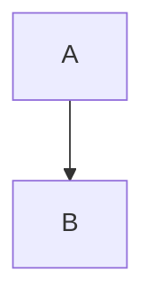

# python-to-mermaid

Generate [Mermaid diagrams](https://mermaid.js.org/) using Python code.

## Installation

### UV

```bash
uv add python-to-mermaid
```

### Pip

```bash
pip install python-to-mermaid
```

## Usage

```python
from python_to_mermaid import MermaidDiagram

diagram = MermaidDiagram()
diagram.add_node("A")
diagram.add_node("B")
diagram.add_edge("A", "B")

mermaid_diagram = str(diagram)
# flowchart TD
#     A
#     B
#     A --> B
```



## Examples

See the [examples](examples) directory for more examples.

- [Node with Text](examples/node_with_text.md)
- [Node Shapes](examples/node_shapes.md)

## Development

```bash
uv sync
```

## Testing

```bash
pytest tests/ -v
```

## Publishing

```bash
./publish.sh
```

```bash
chmod +x publish.sh
```

### Generate Examples

```bash
python examples
```
