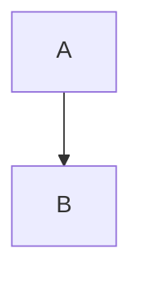

# Python-to-Mermaid: Generate [Mermaid Diagrams](https://mermaid.js.org/) Programmatically with Python 🐍✨

Python-to-Mermaid simplifies the creation of Mermaid.js diagram code using Python. This package allows developers to generate Mermaid syntax for flowcharts, class diagrams, and state machines programmatically, rather than writing Mermaid code manually. It streamlines the process of creating diagrams for API documentation, codebase visualization, and technical documentation.

## Installation

### UV

```bash
uv add python-to-mermaid
```

### Pip

```bash
pip install python-to-mermaid
```

## Usage

```python
from python_to_mermaid import MermaidDiagram

diagram = MermaidDiagram()
diagram.add_node("A")
diagram.add_node("B")
diagram.add_edge("A", "B")

mermaid_diagram = str(diagram)
# flowchart TD
#     A
#     B
#     A --> B
```



## Examples

See the [examples](examples) directory for more examples.

- [Node with Text](examples/node_with_text.md)
- [Node Shapes](examples/node_shapes.md)

## Use Cases

- Technical SEO: Visualize website crawls or redirect maps for audits.
- Code Documentation: Auto-update UML diagrams when code changes.
- Education: Create interactive tutorials with executable diagrams.
- Project Planning: Map user journeys and system architectures.

## Development

```bash
uv sync
```

## Testing

```bash
pytest tests/ -v
```

## Publishing

```bash
./publish.sh
```

```bash
chmod +x publish.sh
```

### Generate Examples

```bash
python examples
```
