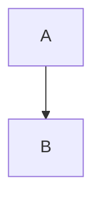

# python-to-mermaid

Generate mermaid diagrams from python code.

## Usage

```python
from python_to_mermaid import MermaidDiagram

diagram = MermaidDiagram()
diagram.add_node("A")
diagram.add_node("B")
diagram.add_edge("A", "B")

mermaid_diagram = str(diagram)
# flowchart TD
#     A
#     B
#     A --> B
```



## Installation

```bash
pip install python-to-mermaid
```

## Development

```bash
uv sync
```

## Testing

```bash
pytest tests/ -v
```

## Publishing

```bash
./publish.sh
```

```bash
chmod +x publish.sh
```
