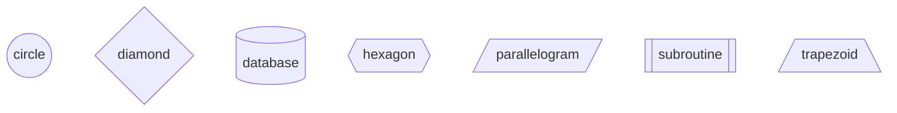

# Node Shapes Example

```python
from python_to_mermaid import MermaidDiagram

diagram = MermaidDiagram()

diagram.add_node("circle", shape="circle")
diagram.add_node("diamond", shape="diamond")
diagram.add_node("database", shape=("[(", ")]"))
diagram.add_node("hexagon", shape="hexagon")
diagram.add_node("parallelogram", shape="parallelogram")
diagram.add_node("subroutine", shape="subroutine")
diagram.add_node("trapezoid", shape="trapezoid")

print(diagram.nodes)
result = str(diagram)
print(result)
```



```bash
flowchart TD
    circle((circle))
    diamond{diamond}
    database[(database)]
    hexagon{{hexagon}}
    parallelogram[/parallelogram/]
    subroutine[[subroutine]]
    trapezoid[/trapezoid\]
```
